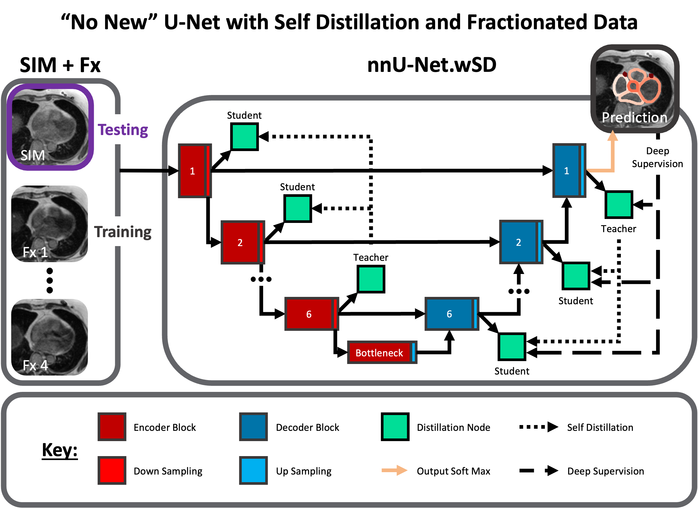

# nnU-Net.wSD

This is a direct extension of the work by [soumbane's DualSelfDistillation](https://github.com/soumbane/DualSelfDistillation) applied to medical image segmentation of the cardiac substructures from low-field ViewRay MR-Linac volumes as presented in the International Journal of Radiation Oncology $\bullet$ Biology $\bullet$ Physics paper: [_Enhancing Precision in Cardiac Segmentation for MR-Guided Radiation Therapy through Deep Learning_]().



We extend the publicly available state-of-the-art deep learning framework, [nnU-Net](https://github.com/MIC-DKFZ/nnUNet/tree/master), to incorporate dual self-distillation along the encoding and decoding branches.


---
## Requirements:
* Python $\geq$ 3.9
* [Pyorch](https://pytorch.org/) $\geq$ 1.12.0
* [Monai](https://monai.io/) $\geq$ 0.9
* [torchmanager](https://github.com/kisonho/torchmanager) $\geq$ 1.1.0

---
## Contents:
This github repository consists of two main parts: 
1) A more user-friendly, flexible version of the DynU-Net backbone
2) The direct, hard coded model used in the cardiac segmentation paper

## Getting started with nnU-Net.wSD:
This section is specifically about the model and associated loss functions. Data handling and the like are not described here. Please see the published paper or `Paper-Implementation/train_SelfDisti_ViewRay_nnUNETOpt.pt` for more details on our implemntation. Additional (general) tutorials on deep learning training can be found [here.](https://github.com/Project-MONAI/tutorials/tree/main/3d_segmentation)

### Model Output during Training:
In short, at every level of both the encoding and decoding branches, the output is collected and upsampled to match the size of the model's main output. The last encoder and decoder respectively form the teacher while all the other levels are the students. KLDivergence losses are calculated between each student and the teacher to enable self-distillation along each branch.

While `network.training == True`, the output of `network.forward(x)` is a `dict` option to make it user-friendly with the following structure:
```
out = {
  'out': torch.Tensor, # The main output of the model
  'encoder': { # Outputs from the encoding branch
     'teacher': torch.Tensor, # output from the deepest / last encoder
     'students': list[torch.Tensor] # outputs from all the students in the encoding branch
  },
  'decoder': { # Outputs from the decoding branch
      'teacher': torch.Tensor, # output from the deepest / last decoder
      'students': list[torch.Tensor] # outputs from all the students in the decoding branch
  }
```
Importantly, the students are in the following order: `[shallowest, ..., second deepest]` where the the second deepest is the closest output to the teacher. 

### Defining the model
The nnU-Net is based off of the Dynamic U-Net backbone with hyper parameters that are tuned through the nnU-Net's framework. To enable the custom training required to enable self-distillation, the nnU-Net's framework is first utilized to generate the model's parameters. In our work, these parameters were then directly taken and used when defining the model's architecture. This is the recommended approach for defining a model.

### Loss functions
The composite loss during training includes the direct comparison between model output and ground truth, the different levels of super-vision down the decoding branch, as well as the levels of self-distillation along both the encoding and decoding branches.

The included class `Model.Losses.SelfDistil_Losses.CompositeLoss` was built to taken in the output dictionary as defined above and calculate the described losses.

```
from Model.Losses import CompositeLoss
loss_fn = CompositeLoss(
    n_layers: The number of layers in the model -> corresponds to the length of filters
    segmentation_loss: The segmentation loss function that compares with ground truth
    distillation_loss: The self-distillation loss function that compares with the teacher
    temperature: A smoothing factor of logits from both students and teachers
    weights_segmentation_loss: Multiplicative weights that effect the segmentation loss in the following order: [Main output, teacher, second deepest, ..., shallowest]. The length of this should match the number of layers.
    weights_distillation_loss: Multiplicative weights that effect the distillation loss in the following order:
[second deepest, ..., shallowest]. The length of this should match the number of layers - 2.
    return_just_loss: Boolean toggle to return just the loss or a dictionary of losses.
    target: the `key` value of a data dictionary that contains the ground truth, this is for use in the `torchmanager` module.
)
```

## Paper Implementation:
The flexible version presented in `nnU-Net.wSD` is a true implementation of the same method used in the paper. The hard coded equivalent nnU-Net.wSD-SIM+Fx method, along side data augmentation / loading, testing, et cetera is provided under `Paper-Implementation`. Data and checkpoints are not included. The training log outputs from the experiments are provided under `Paper-Implementation/Experiment-Logs`.
